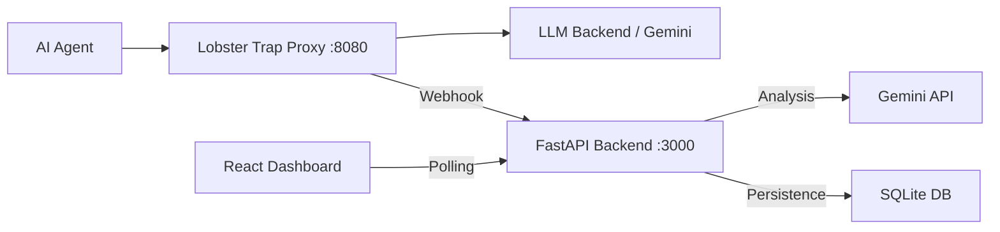

# ContextGuard 🛡️

**ContextGuard** is an enterprise-grade AI security platform designed to monitor, intercept, and secure third-party AI agent interactions. Built in response to systemic supply-chain vulnerabilities (like the Vercel/Context.ai breach), ContextGuard provides real-time Deep Prompt Inspection (DPI) and OAuth risk scanning to protect organizational data.

---

## 🚀 Key Features

- **Deep Prompt Inspection (DPI):** Real-time interception and analysis of AI agent traffic using **Veea Lobster Trap**.
- **Gemini Risk Engine:** Advanced threat classification and risk scoring powered by **Google Gemini 2.0 Flash**.
- **OAuth Risk Scanner:** Automated scanning and auditing of third-party application permissions within Google Workspace.
- **Secure Audit Logging:** PII-redacted, SHA-256 hashed audit trails for compliance and forensics.
- **Security Dashboard:** High-fidelity React dashboard for real-time threat visualization and reporting.

---

## 🏗️ Architecture

ContextGuard operates as a transparent security layer between your AI agents and their LLM backends.



---

## 🛠️ Installation & Setup

### 1. Prerequisites
- **Python 3.11+**: [Download Python](https://www.python.org/downloads/)
- **Go 1.22+**: Required to build or run Lobster Trap from source. [Download Go](https://go.dev/dl/)
- **Google Gemini API Key**: [Get a Key](https://aistudio.google.com/)

### 2. Lobster Trap Setup
Lobster Trap is a high-performance DPI proxy written in Go.
1. **Verify Go Installation:**
   ```bash
   go version
   ```
2. **Setup the Binary:**
   - For convenience, the pre-compiled `lobstertrap.exe` (v0.1.0) is included in the `lobster/` directory.
   - If you need to rebuild it from source:
     ```bash
     git clone https://github.com/veea-ai/lobstertrap.git
     cd lobstertrap
     go build -o lobstertrap.exe
     ```

### 3. Environment Configuration
Create a `.env` file in the `backend/` directory:
```env
GEMINI_API_KEY=your_api_key_here
DASHBOARD_PASSWORD=admin_secret
GOOGLE_WORKSPACE_CREDS=path/to/service_account.json
```

### 4. Virtual Environment & Dependencies
```bash
# Create venv
python -m venv venv

# Activate (Windows)
.\venv\Scripts\activate

# Install dependencies
pip install -r requirements.txt
```

---

## 🚦 Running the Project

To fully run the ContextGuard security pipeline, open four terminals:

### Terminal 1: FastAPI Backend
```bash
cd backend
..\venv\Scripts\python -m uvicorn main:app --port 3000 --host 0.0.0.0
```

### Terminal 2: Lobster Trap DPI Proxy
```bash
cd lobster
.\lobstertrap.exe serve --policy configs/default_policy.yaml --backend https://api.aimlapi.com --listen :8080 --audit-log lobster_audit.jsonl
```

### Terminal 3: Webhook Bridge
```bash
cd lobster
..\venv\Scripts\python webhook_bridge.py --log-file lobster_audit.jsonl
```

### Terminal 4: Demo Simulator
```bash
# Run the E2E simulation to verify the pipeline
cd demo
..\venv\Scripts\python simulate_traffic.py
```

---

## 🧪 Automated Testing
ContextGuard includes a comprehensive test suite to verify DPI policies and NFR latency requirements.

```bash
pytest tests/test_dpi_pipeline.py -v
```

---

## 📄 Documentation
Detailed project documentation and architecture reviews are available in the `docs/` directory:
- [SRS Document](docs/ContextGuard_SRS_Document.md)
- [Requirements Traceability Matrix (RTM)](docs/RTM.md)
- [Project Status & Architecture Review](docs/Project_Status_and_Architecture_Review.md)
- [Implementation Summary](docs/Implementation_Summary.md)

---

## 🛡️ License
This project is built for the **Transforming Enterprise Through AI** hackathon. 
Lobster Trap is licensed under the MIT License by Veea Inc.
