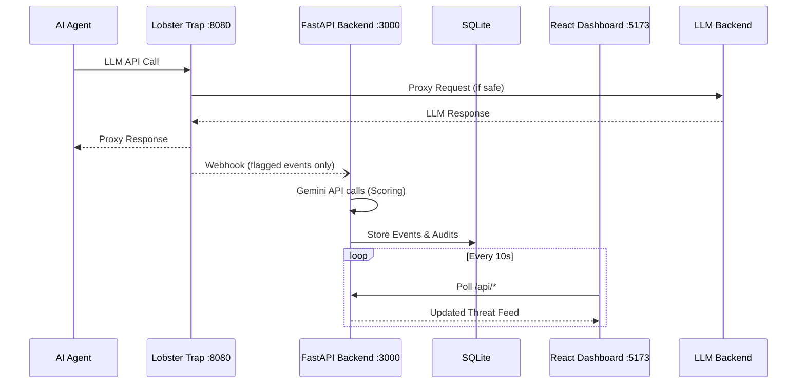

# ContextGuard — SRS v1.0

## SOFTWARE REQUIREMENTS SPECIFICATION  
ContextGuard  
Third-Party AI Tool Risk Monitor & Enterprise Security Platform  
Version 1.0  |  May 2026 
Hackathon: Transforming Enterprise Through AI — lablab.ai  

---

## Document
Software Requirements Specification — ContextGuard

## Version
1.0

## Date
May 15, 2026

## Hackathon
Transforming Enterprise Through AI — lablab.ai

## Track
Track 1: Agent Security & AI Governance (powered by Veea)

## Scope
Lean, demo-ready implementation for hackathon submission

## Status
Active — Hackathon Build

---

Lean. Focused. Demo-ready. Built on a real breach.

---

## Table of Contents
1. Introduction & Problem Statement  
2. System Scope  
3. Technology Stack  
4. Functional Requirements  
5. Non-Functional Requirements  
6. System Architecture  
7. External Interfaces  
8. Constraints & Assumptions  
9. Glossary  

---

## 1. Introduction & Problem Statement

### 1.1 Purpose of This Document
This Software Requirements Specification defines the functional and non-functional requirements for ContextGuard — a focused, demo-ready enterprise security platform built for the Transforming Enterprise Through AI hackathon. The document intentionally scopes the system to four core features that can be fully built, tested, and demonstrated within the hackathon timeline.

### 1.2 The Real-World Problem — AI Supply-Chain Breach

Recently, a major cloud deployment platform suffered a significant security breach. The official security bulletin revealed the following attack chain:

| Step | Action |
|------|--------|
| Step 1 | Attacker compromised a third-party AI tool used by an employee. |
| Step 2 | The compromised AI tool abused its legitimate Google Workspace OAuth access to read the employee's emails and Drive documents. |
| Step 3 | The attacker pivoted from Google Workspace into the employee's cloud infrastructure account. |
| Step 4 | The attacker executed prompt-injection payloads against the company's internal AI agents to exfiltrate database credentials from environment variables. |
| IOC | OAuth App ID: 110671459871-30f1spbu0hptbs60cb4vsmv79i7bbvqj.apps.googleusercontent.com — indicating a broader supply-chain attack affecting hundreds of organizations. |

This breach is not an isolated incident — it is an example of a new class of enterprise attack: the compromised third-party AI tool. As organizations adopt more AI-powered SaaS tools, each one becomes a potential entry point into organizational infrastructure through OAuth permissions.

1. Enterprises have no centralized visibility into which AI tools employees have authorized.  
2. OAuth permissions granted to AI tools are rarely reviewed, audited, or revoked.  
3. There is no runtime monitoring of what AI agents are doing with the access they have been granted.  
4. Security teams cannot distinguish between legitimate AI tool activity and adversarial exploitation.  
5. Environment variables are frequently left unclassified — secrets mixed with non-secrets, all equally exposed.  

### 1.4 The ContextGuard Answer
ContextGuard is a focused security platform that addresses this exact attack vector. It monitors third-party AI tool OAuth permissions, intercepts AI agent traffic for threat inspection, scores risk using Gemini AI, and surfaces everything in a clean security dashboard — all in a form that can be built and demonstrated within the hackathon timeline.

### 1.5 Definitions

| Term | Definition |
|------|----------|
| OAuth App | A third-party application granted delegated access to organizational accounts via OAuth 2.0. |
| DPI | Deep Prompt Inspection — analysis of LLM prompt and response content for threat patterns. |
| IOC | Indicator of Compromise — an observable artifact indicating a potential security incident. |
| Lobster Trap | Veea's MIT-licensed DPI proxy that sits between AI agents and LLM backends. |
| Risk Score | A 0–100 numerical value representing the threat level of a connected OAuth application. |
| Gemini | Google's family of multimodal AI models used for intelligence and analysis in ContextGuard. |
| FR | Functional Requirement — a specific behavior the system must exhibit. |
| NFR | Non-Functional Requirement — a quality constraint the system must satisfy. |

---

## 2. System Scope

### 2.1 What ContextGuard Does — The Core Loop

SCAN OAuth Apps  
↓  
INTERCEPT Agent Traffic via Lobster Trap  
↓  
SCORE Risk with Gemini AI  
↓  
ALERT on Dashboard  

### 2.2 Four Features — In Scope

| # | Feature | What It Does |
|---|--------|-------------|
| F1 | OAuth Risk Scanner | Scans connected OAuth apps, matches against known IOCs, assigns risk scores. |
| F2 | Lobster Trap DPI Layer | Transparent proxy that intercepts all AI agent LLM traffic and enforces security policies. |
| F3 | Gemini Risk Engine | Uses Gemini 2.5 Flash to classify threats, score risk, and generate plain-English alerts. |
| F4 | Security Dashboard | React-based UI showing threat feed, risk scores, and one basic compliance report. |

### 2.3 Explicitly Out of Scope

| Removed Feature | Reason Removed |
|---------------|--------------|
| Red-Team Simulator | Separate module — adds build time without improving core demo. |
| Multi-framework compliance reports | SOC2 + HIPAA + PCI-DSS simultaneously — one report is sufficient for demo. |
| Environment Variable Guardian (module) | Covered implicitly by Lobster Trap DPI; no need for a separate module. |
| WebSocket real-time push | Simple polling every 10 seconds achieves the same demo effect. |
| Role-based access control | Judges do not evaluate auth flows — single admin login is sufficient. |
| Redis cache layer | SQLite handles demo-scale data without a caching layer. |
| PostgreSQL | Replaced with SQLite — zero-config, sufficient for hackathon scale. |
| Docker Compose multi-service | Single Docker container keeps deployment simple for demo. |

---

## 3. Technology Stack

### 3.1 Full Stack Overview

| Layer | Technology | Version | Why This Choice |
|------|-----------|--------|----------------|
| AI — Analysis | Google Gemini 2.5 Flash | Latest | Fast, free tier available, sufficient for real-time risk scoring and alert generation. |
| AI IDE | Google AI Studio | Web | Used for prompt engineering and testing Gemini integration during build phase. |
| Security Proxy | Veea Lobster Trap | MIT | Drop-in DPI proxy — zero code changes required in proxied agents, YAML-based policies. |
| Backend | Python 3.11 + FastAPI | 0.111 | Lightweight, async, automatic API docs, fast to build. |
| Database | SQLite 3 | Built-in | Zero-config, no server required, sufficient for demo-scale audit logs. |
| Frontend | React 18 | 18.x | Component-based UI, fast development, large ecosystem. |
| Styling | Tailwind CSS 3 | 3.x | Utility-first, no custom CSS needed, clean dashboard look. |
| Charts | Recharts | 2.x | Simple React charting for risk score trend visualization. |
| Auth (OAuth scan) | Google Workspace API | v1 | Official API to enumerate connected OAuth apps and permissions. |
| Deployment | Any Cloud | Free | One-click deploy, shareable demo URL for judges. |

---

## 4. Functional Requirements

### 4.1 F1 — OAuth Risk Scanner

| ID | Requirement | Priority |
|----|------------|---------|
| FR-1.1 | The system SHALL connect to the Google Workspace OAuth API and retrieve a list of all third-party applications that have been granted access to organizational accounts. | HIGH |
| FR-1.2 | For each OAuth app, the system SHALL extract: app name, publisher, list of granted permission scopes, number of authorized users, and date of last authorization. | HIGH |
| FR-1.3 | The system SHALL maintain a local IOC list seeded with a known breach OAuth App ID (110671459871-30f1spbu0hptbs60cb4vsmv79i7bbvqj.apps.googleusercontent.com) and flag any matching app as CRITICAL. | HIGH |
| FR-1.4 | The system SHALL send each app's details to the Gemini Risk Engine and store the returned risk score (0–100) in the SQLite database. | HIGH |
| FR-1.5 | The system SHALL trigger a re-scan on demand via a button in the dashboard. | HIGH |
| FR-1.6 | The system SHALL allow an administrator to manually add new IOC entries to the local IOC list. | MEDIUM |
| FR-1.7 | The system SHALL run automatic background scans on a configurable schedule (default: every 6 hours). | LOW |

---

## 5. Non-Functional Requirements

### 5.1 Performance

| ID | Requirement | Target Value |
|----|------------|-------------|
| NFR-1.1 | Lobster Trap mean added latency per LLM API call | < 200ms |
| NFR-1.2 | Gemini risk score returned per OAuth app | < 5 seconds |
| NFR-1.3 | Dashboard data refresh cycle (polling interval) | 10 seconds |
| NFR-1.4 | Compliance report generation time | < 15 seconds |
| NFR-1.5 | OAuth scan completion for up to 50 apps | < 2 minutes |
| NFR-1.6 | Dashboard initial page load time | < 3 seconds |

---

## 6. System Architecture

### 6.2 Data Flow

---

## 7. External Interfaces

### 7.1 External APIs

| API | Protocol | Auth Method | Used For |
|-----|---------|------------|----------|
| Google Gemini API | HTTPS REST | API Key (env var) | Risk scoring, threat classification, alert generation, compliance report. |
| Google Workspace Admin SDK | HTTPS REST | OAuth 2.0 Service Account | Enumerate connected OAuth apps and their permission scopes. |
| Veea Lobster Trap | HTTP Proxy | None (localhost) | DPI policy enforcement; webhook events sent to FastAPI backend. |

---

## 8. Constraints & Assumptions

### 8.1 Hackathon Constraints

| Constraint | Impact | Mitigation |
|-----------|--------|-----------|
| Google Workspace admin credentials not available | OAuth scan must use a simulated or developer-owned Workspace account | Pre-load demo with 10 realistic synthetic OAuth app records |
| Gemini free tier: 15 requests/minute | Bulk scoring of many apps may be rate-limited | Batch scoring with 4-second delay between calls; cache scores for 1 hour |
| No production LLM agent available | Lobster Trap has no real agent traffic to inspect | Demo script sends synthetic prompts through the proxy to trigger policies |
| Build time: 5 days | Cannot implement all originally planned features | Strict scope: only 4 features, only HIGH-priority requirements |

---

## 9. Glossary

| Term | Definition |
|------|----------|
| Blast Radius | The maximum scope of damage an attacker could achieve by fully exploiting a compromised OAuth token. |
| Third-party AI Tool | The AI tool compromised in an enterprise supply-chain breach — the initial attack vector. |
| DPI | Deep Prompt Inspection — analysis of LLM prompt and response content at the proxy layer. |
| Fail-Open | A safety design where a security control passes traffic through unimpeded if the control itself fails, prioritizing availability over enforcement. |
| IOC | Indicator of Compromise — a specific observable artifact (e.g., an OAuth App ID) that indicates malicious activity. |
| Lobster Trap | Veea's MIT-licensed Go binary that acts as a transparent DPI proxy between AI agents and LLM backends. |
| OAuth Scope | A specific permission granted to a third-party app, such as 'read email' or 'manage calendar'. |
| Policy Rule | A YAML-defined condition and action pair in Lobster Trap (e.g., if credential pattern detected, then QUARANTINE). |
| Prompt Injection | An attack where malicious instructions in user input manipulate an AI agent into taking unintended actions. |
| Risk Score | A 0–100 numeric value computed by Gemini representing the threat level of a connected OAuth application. |
| Supply-Chain Attack | An attack that targets a less-secure third-party component to gain access to the primary target. |

---

End of Document — ContextGuard SRS v1.0
ContextGuard SRS  |  Transforming Enterprise Through AI  |  May 2026